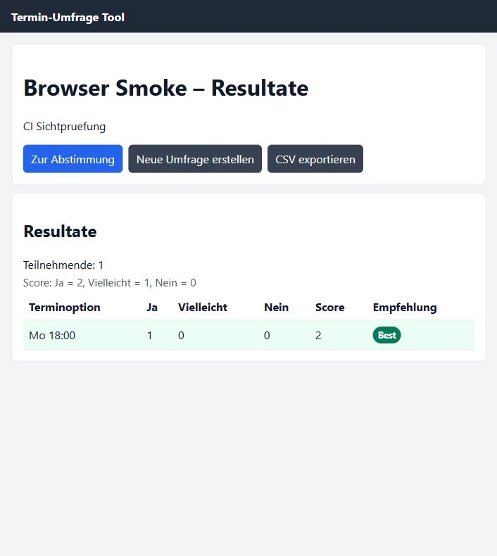

# Terminumfrage-Tool (Mini-Doodle)

MVP einer einfachen Terminumfrage als standalone Web-App mit **React + Vite + TypeScript**.

Live-Deployment: https://im23a-hajnikm.github.io/ffit4-terminumfrage-tool/

## Schnellstart

```bash
npm install
npm run dev
```

Danach im Browser `http://localhost:5173` öffnen.

## MVP-Features

- Umfrage erstellen (Titel Pflicht, Beschreibung optional, Terminoptionen)
- Kalenderbasierte Auswahl von Datum und Uhrzeit für Terminoptionen
- Seitenstruktur: `/create`, `/poll/:id`, `/poll/:id/results`
- Lokale Abstimm- und Resultatansicht innerhalb desselben Browserprofils
- Abstimmen mit Name (Ja/Nein/Vielleicht)
- Erneute Abstimmung mit gleichem Namen aktualisiert die Stimme
- Stimme per Name löschen
- Resultate je Option mit Teilnehmerzahl, Score und bester Option
- CSV-Export der Resultate
- Fehlerfälle (fehlender Titel/Name), Reset aller lokalen Umfragen

## Speicherung

Aktuell **LocalStorage** (Key: `terminumfrage.polls.v1`) für schnelles MVP ohne Backend.

Limitierung: Polls sind lokal im jeweiligen Browser gespeichert. Öffentliche Abstimm- oder Ergebnislinks funktionieren ohne Backend nicht zuverlässig; die Resultate sind deshalb intern über die App erreichbar. Für echte teamübergreifende Links wäre ein Backend/Supabase die nächste Ausbaustufe.

## Screenshot



## CI/CD und Deployment

- `frontend-job`: installiert Dependencies, prüft Formatierung/Linting, führt Coverage-Tests aus, baut die App und lädt `dist/` als Artifact hoch.
- `deploy-static-site`: baut die Vite-App mit GitHub-Pages-Basispfad und veröffentlicht sie via GitHub Pages.
- `Jenkinsfile`: enthält dieselben lokalen Qualitätsstufen für eine Jenkins-Pipeline.
- `sonar-project.properties`: bindet Vitest-LCOV für SonarQube/SonarCloud ein.

## Requirements

- Git-Setup im Repo: `git config pull.rebase true`
- Ziel für Setup-Issue: `npm install` und `npm run dev` müssen lokal funktionieren.

## Quality Checks

```bash
npm run format-check
npm run lint-check
npm run test-coverage
npm run tsc
npm run build
```
